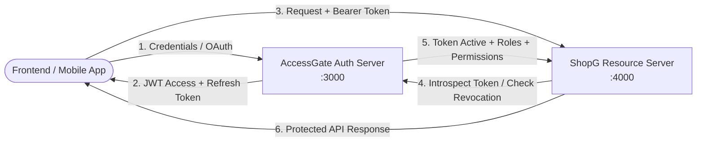

# AccessGate Integration Guide 🔌

> Comprehensive guide for integrating external Node.js services and microservices (e.g., **ShopG**) with **AccessGate** as the central Identity Provider (IdP) using `@accessgate/sdk`.

---

## 📑 Table of Contents

- [Architecture Overview](#-architecture-overview)
- [SDK Installation](#-sdk-installation)
- [Verification Strategies: Remote vs. Local](#-verification-strategies-remote-vs-local)
- [Client Initialization & Options](#-client-initialization--options)
- [Express Middleware Usage](#-express-middleware-usage)
  - [`requireAuth()`](#requireauth)
  - [`requireRole(roleName)`](#requirerolerolename)
  - [`requirePermission(permissionName)`](#requirepermissionpermissionname)
- [Token Introspection Endpoint (`POST /token/introspect`)](#-token-introspection-endpoint-post-tokenintrospect)
- [Full ShopG Microservice Integration Example](#-full-shopg-microservice-integration-example)
- [Error Handling & Status Codes](#-error-handling--status-codes)

---

## 🏛 Architecture Overview

In an enterprise microservices architecture, AccessGate functions as the **Central Authorization Server**, while backend applications like **ShopG** (an e-commerce service) act as **Resource Servers**:



1. **Client** authenticates with AccessGate (`POST /auth/login` or Google OAuth).
2. **AccessGate** issues cryptographically signed JWT access tokens and long-lived refresh tokens.
3. **Client** calls resource APIs (e.g., ShopG) with `Authorization: Bearer <accessToken>`.
4. **ShopG** uses the `@accessgate/sdk` middleware to verify the token either via **Remote Introspection** (`POST /token/introspect`) or **Local Cryptographic Verification**.

---

## 📦 SDK Installation

Install the official AccessGate SDK package in your service:

```bash
npm install @accessgate/sdk
```

*(Or reference locally via workspace or monorepo path: `file:../../packages/accessgate-sdk`)*.

---

## ⚖️ Verification Strategies: Remote vs. Local

The AccessGate SDK supports two operating modes depending on your performance and security requirements:

| Strategy | How It Works | Latency | Revocation Speed | Best Used When |
| :--- | :--- | :---: | :---: | :--- |
| **Remote Introspection (Recommended)** | Calls AccessGate `POST /token/introspect` with in-memory TTL caching | ~2–5 ms (Cached: <0.1 ms) | **Immediate** (reflects Redis blacklist in real-time) | Zero-trust environments, financial endpoints, sensitive operations |
| **Local JWT Verification** | Validates JWT signature offline using shared `JWT_SECRET` | <0.1 ms | Eventual (until token's 15m expiry) | High-throughput read-heavy APIs where network hops must be minimized |

---

## ⚙️ Client Initialization & Options

```javascript
import { AccessGate } from '@accessgate/sdk';

// Initialize AccessGate Client
const auth = new AccessGate({
  // 1. Remote Introspection (Default)
  issuerUrl: process.env.ACCESSGATE_URL || 'http://localhost:3000',

  // 2. Local Verification (Optional: provides offline verification fallback)
  jwtSecret: process.env.ACCESSGATE_JWT_SECRET,

  // 3. Performance Tuning
  cacheTtlMs: 30000, // In-memory cache for validated tokens (default: 30s)
  timeoutMs: 5000,   // HTTP timeout for remote introspection (default: 5s)
});
```

### Configuration Options Reference

| Option | Type | Default | Description |
| :--- | :--- | :--- | :--- |
| `issuerUrl` | `string` | `process.env.ACCESSGATE_URL` | Base URL of your AccessGate authentication server |
| `jwtSecret` | `string` | `process.env.ACCESSGATE_JWT_SECRET` | Secret key for local JWT signature validation |
| `introspectEndpoint`| `string` | `${issuerUrl}/token/introspect` | Custom introspection URL if overridden |
| `cacheTtlMs` | `number` | `30000` | In-memory cache TTL in milliseconds (0 disables cache) |
| `timeoutMs` | `number` | `5000` | Introspection HTTP request timeout in milliseconds |

---

## 🛡 Express Middleware Usage

### `requireAuth()`

Extracts the Bearer token from the `Authorization` header, verifies validity, and enriches `req.user` with user identity, roles, and permissions:

```javascript
app.get('/api/profile', auth.requireAuth(), (req, res) => {
  // req.user contains:
  // {
  //   id: 'uuid',
  //   email: 'user@example.com',
  //   role: 'user',
  //   roles: ['user'],
  //   permissions: ['orders:read', 'orders:create']
  // }
  res.json({ user: req.user });
});
```

### `requireRole(roleName)`

Verifies that the authenticated user possesses the specified role (`admin`, `moderator`, `user`). Returns `403 Forbidden` if missing:

```javascript
// Protect route for administrators only
app.delete('/api/users/:id', auth.requireAuth(), auth.requireRole('admin'), (req, res) => {
  res.json({ message: 'User account deleted by admin' });
});
```

### `requirePermission(permissionName)`

Fine-grained authorization checking permissions. Wildcard `'*'` (possessed by administrators) automatically satisfies any permission check:

```javascript
// Protect route for users with catalog modification rights
app.post(
  '/api/products',
  auth.requireAuth(),
  auth.requirePermission('products:create'),
  (req, res) => {
    res.status(201).json({ message: 'Product created' });
  }
);
```

---

## 🔍 Token Introspection Endpoint (`POST /token/introspect`)

AccessGate exposes an RFC 7662-compliant introspection API at `/token/introspect` and `/api/v1/token/introspect`.

### Request Format

```http
POST /token/introspect HTTP/1.1
Host: localhost:3000
Content-Type: application/json

{
  "token": "eyJhbGciOiJIUzI1NiIsInR5cCI6IkpXVCJ9.eyJzdWIiOi..."
}
```

### Successful Response (`200 OK`)

```json
{
  "active": true,
  "sub": "a1b2c3d4-e5f6-7890-abcd-ef1234567890",
  "user": {
    "id": "a1b2c3d4-e5f6-7890-abcd-ef1234567890",
    "email": "admin@shopg.com",
    "name": "Jane Doe",
    "role": "admin",
    "roles": ["admin"],
    "permissions": ["*", "orders:read", "orders:write", "products:create"],
    "is_active": true
  },
  "roles": ["admin"],
  "permissions": ["*", "orders:read", "orders:write", "products:create"],
  "exp": 1728345600,
  "iat": 1728342000
}
```

### Inactive / Revoked Response (`200 OK`)

```json
{
  "active": false,
  "error": "Token has been revoked"
}
```

---

## 🛒 Full ShopG Microservice Integration Example

Here is a complete, runnable Express application showing how an e-commerce microservice (**ShopG**) integrates with AccessGate:

```javascript
import express from 'express';
import { AccessGate } from '@accessgate/sdk';

const app = express();
app.use(express.json());

// 1. Initialize AccessGate SDK
const auth = new AccessGate({
  issuerUrl: process.env.ACCESSGATE_URL || 'http://localhost:3000',
  cacheTtlMs: 30000, // 30-second token cache
});

// 2. Public Catalog Endpoint (No auth required)
app.get('/api/products', (req, res) => {
  res.json({
    products: [
      { id: 'prod_1', name: 'Mechanical Keyboard', price: 99.99 },
      { id: 'prod_2', name: 'Wireless Mouse', price: 49.99 },
    ],
  });
});

// 3. Authenticated Order History (Any authenticated customer)
app.get('/api/orders', auth.requireAuth(), (req, res) => {
  res.json({
    message: 'User orders',
    userId: req.user.id,
    orders: [{ id: 'ord_1', total: 99.99 }],
  });
});

// 4. Permission-Protected Checkout (Requires 'orders:create')
app.post(
  '/api/orders',
  auth.requireAuth(),
  auth.requirePermission('orders:create'),
  (req, res) => {
    res.status(201).json({
      message: 'Order created successfully',
      customerId: req.user.id,
      orderDetails: req.body,
    });
  }
);

// 5. Role-Protected Admin Endpoint (Requires 'admin' role)
app.post(
  '/api/products',
  auth.requireAuth(),
  auth.requireRole('admin'),
  (req, res) => {
    res.status(201).json({
      message: 'Product added to catalog by Admin',
      product: req.body,
    });
  }
);

// Start ShopG service on port 4000
app.listen(4000, () => {
  console.log('🛒 ShopG service listening on port 4000');
  console.log(`🔒 Protected by AccessGate at ${auth.issuerUrl}`);
});
```

---

## 🚨 Error Handling & Status Codes

The SDK returns RFC-compliant HTTP status codes:

| HTTP Status | Error Type | Scenario |
| :---: | :--- | :--- |
| **`401 Unauthorized`** | `Unauthorized` | Missing `Authorization` header, invalid signature, expired token, or token blacklisted in Redis |
| **`403 Forbidden`** | `Forbidden` | Authenticated subject lacks the requisite role (`requireRole`) or permission (`requirePermission`) |
| **`500 Internal Server Error`** | `InternalServerError` | Network timeout or unreachable AccessGate introspection service (when no local secret is configured) |

### Standard Error Response Format

```json
{
  "error": "Forbidden",
  "message": "Access denied. Requires 'admin' role."
}
```
